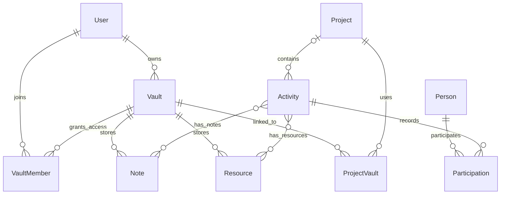
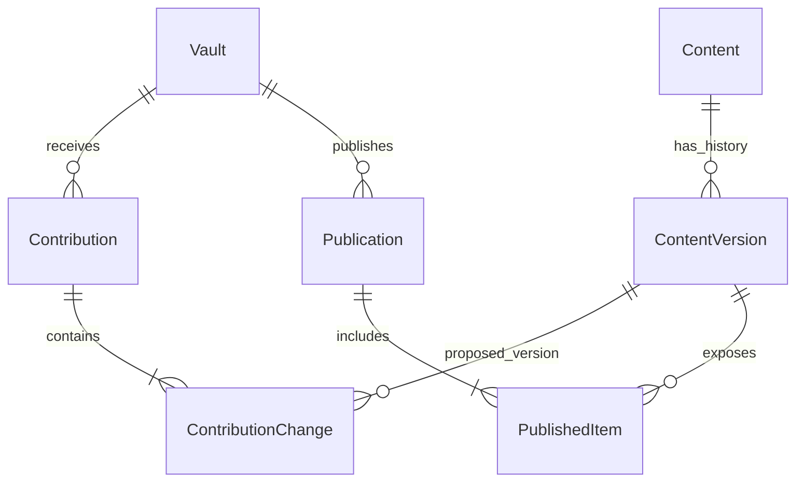

# WisdomTree — thiết kế lấy vault làm trung tâm

> Cập nhật yêu cầu 2026-10-02: người dùng bỏ Vault khỏi luồng sản phẩm, dùng Project làm trọng tâm. Thiết kế Vault dưới đây là lịch sử; phase 2 Vault đã dừng, không tiếp tục triển khai theo plan này. Ưu tiên hiện tại: làm gọn Project, thống nhất trang con và hướng dẫn trong popup [?].

Ngày: 2026-10-02. Bản đầu và bản cập nhật bổ sung hồ sơ dự án/hoạt động, ERD đã được người dùng duyệt; được phép lập kế hoạch triển khai.

## 1. Mục tiêu đã thống nhất

WisdomTree giúp người không chuyên kỹ thuật và người làm nghiên cứu lưu kiến thức, ghi nhận dự án/hoạt động đã tham gia, và tuyển chọn nội dung để làm báo cáo hoặc portfolio. Vault là kho ghi chú và tài liệu, với mô hình sở hữu và đóng góp tương tự GitHub; hồ sơ dự án và hoạt động có cấu trúc riêng. Không có AI trong phạm vi này.

- Mỗi người có thể sở hữu nhiều vault.
- Vault chứa ghi chú, tài liệu như PDF/TXT và thư mục tùy chọn.
- Chủ vault có thể mời cộng tác viên. Đóng góp chỉ vào nội dung chính khi chủ vault chấp nhận.
- Có thể xuất bản toàn bộ vault hoặc từng ghi chú. Hồ sơ dự án và portfolio có phạm vi xuất bản riêng; xuất bản dự án không tự công khai các vault được liên kết. Người ngoài không cần tài khoản để đọc nội dung đã xuất bản, giống blog.
- Ghi nhận các hoạt động như talk, triển lãm, festival; người tham gia, vai trò và dự án liên quan. Hoạt động có thể độc lập, không bắt buộc thuộc dự án.
- Thư mục, tags, danh sách và graph là các cách xem dữ liệu đã lưu. Graph giúp trả lời “ai làm gì, trong dự án nào”; báo cáo và portfolio tuyển chọn từ hồ sơ và nội dung này.
- Thảo luận công việc ở cạnh nội dung; chat hằng ngày ở khu vực riêng trong app.
- Ưu tiên chữ dễ đọc, ít thao tác, điều hướng dễ học và không mất nội dung đang viết.

## 2. Cấu trúc và ranh giới

```text
Không gian cá nhân
├── Vault của tôi
│   ├── Vault A
│   │   ├── Thư mục (tùy chọn)
│   │   ├── Ghi chú
│   │   └── Tài liệu
│   └── Vault B
├── Vault được chia sẻ
├── Dự án và hoạt động
│   ├── Hồ sơ dự án
│   └── Hồ sơ hoạt động và người tham gia
├── Portfolio và báo cáo
└── Trò chuyện
```

Không gian cá nhân là màn hình tập hợp, không phải một tầng chứa nội dung hoặc một quyền chia sẻ chung. Vault là ranh giới sở hữu, quyền cộng tác và xuất bản của ghi chú/tài liệu. Project là hồ sơ dự án; Activity là hồ sơ hoạt động. Không đặt Project bên trong Vault hoặc coi hai loại này là một.

Một Project liên kết được nhiều Vault và một Vault có thể phục vụ nhiều Project. Mỗi ghi chú/tài liệu thuộc đúng một Vault; liên kết tới dự án/hoạt động không sao chép hoặc di chuyển nội dung. Đóng góp đã duyệt vào vault khác vẫn là một bản thuộc vault đích, giữ nguồn gốc như mục 5; khác với thao tác chỉ liên kết nội dung.

### ERD khái niệm đã thống nhất

Sơ đồ là hợp đồng quan hệ sản phẩm, không phải yêu cầu gộp bảng Notes và Resources hoặc viết lại toàn bộ schema hiện có.



Các quan hệ nhiều–nhiều dùng bảng liên kết cụ thể: ProjectVault, Participation, ActivityNote và ActivityResource. Person là người trong hồ sơ, có thể không có tài khoản. Liên kết tùy chọn Person–User nối hồ sơ với tài khoản có xác nhận; không suy ra chúng là cùng người chỉ từ tên hiển thị. Participation ghi vai trò của người trong từng hoạt động, khác với vai trò tài khoản trong vault.

### Tuyển chọn và quản lý hồ sơ

Project có tên, mô tả, trạng thái, người liên quan và các hoạt động. Activity có tên, loại, mô tả, trạng thái, thời gian, địa điểm, người tham gia/vai trò, và Project tùy chọn. Các loại mặc định gồm talk, triển lãm và festival; cho phép thêm loại phù hợp thay vì buộc nhập biến thể tên cho mỗi hoạt động. Loại hoạt động là phân loại chính, tags là nhãn bổ sung và không thay thế loại.

Từ trang hoạt động, người dùng thêm người tham gia, liên kết ghi chú/tài liệu đã có hoặc tạo nội dung mới. Khi tạo nội dung mới, app lưu vào vault mặc định có quyền phù hợp, cho phép đổi vault rồi tự liên kết sau khi nội dung tồn tại và quyền cho phép. Cộng tác viên tạo đề xuất thì liên kết chờ đi cùng đề xuất, chỉ thành liên kết bản chính sau khi duyệt; không làm lộ bản nháp qua hồ sơ hoạt động.

Người quản lý hồ sơ dự án/hoạt động xác nhận thông tin hồ sơ và liên kết; chủ vault duyệt thay đổi nội dung trong vault. Người tạo hoạt động độc lập quản lý hồ sơ đó, chỉ chia sẻ khi chọn người/nhóm được đọc. Hồ sơ nhóm dùng quyền thành viên/quản lý của nhóm hiện có; có mặt trong Participation không tự cấp quyền đọc hoặc sửa. Khi gắn hoặc gỡ Project, không tự mở rộng người được đọc hồ sơ; thay đổi phạm vi chia sẻ phải được xác nhận riêng. Mô hình quyền hồ sơ phải có đích bảo vệ độc lập với Project tùy chọn, không chỉ bỏ NOT NULL của project_id.

Một liên kết chỉ được tạo khi người thực hiện có quyền quản lý hồ sơ đích và đọc nội dung nguồn. Người đọc hồ sơ không có quyền đọc nguồn không được thấy tiêu đề, preview hoặc file riêng tư qua liên kết. Trang hồ sơ vẫn đọc được phần thông tin họ được cấp quyền; liên kết không cấp quyền ngược về vault.

Báo cáo lọc hồ sơ theo thời gian, loại, dự án và người tham gia/vai trò. Hoạt động chưa có ngày hiển thị là “Chưa ghi nhận thời gian”; không lấy ngày tạo bản ghi làm ngày hoạt động. Đếm hoạt động theo ID duy nhất, không nhân số hoạt động theo số người hay tài liệu được liên kết. Portfolio cá nhân/nhóm là bộ hồ sơ và tài liệu được chọn, sắp xếp và giới thiệu; không là vault mới. Tuyển chọn không tự sửa dữ liệu gốc hoặc công khai nội dung được chọn.

### Thư mục, tags và graph

Thư mục sắp xếp ghi chú/tài liệu bên trong vault; tags và bộ lọc có thể dùng trên nội dung, dự án và hoạt động. Các cách xem cùng trỏ tới ID nội dung/hồ sơ đã lưu, không tạo bản sao khi đổi cách xem. Tôn trọng quyền của từng đối tượng trong mọi cách xem.

Graph lấy quan hệ từ dữ liệu đã xác nhận, với các liên kết có nghĩa: tham gia (kèm vai trò), thuộc dự án, vault phục vụ dự án, tài liệu/ghi chú của hoạt động, và nguồn hỗ trợ ghi chú. Ví dụ: Lan → diễn giả tại Talk A → thuộc Dự án B → có tài liệu trong Vault C. Đổi loại hoạt động hoặc vai trò phải phản ánh trong graph và báo cáo. Không suy diễn quan hệ bằng AI và không cần một hệ lưu trữ graph riêng.

### Phiên bản, đóng góp và xuất bản



Content/ContentVersion là khái niệm chung cho Note/NoteVersion hoặc Resource/ResourceVersion, không bắt buộc có bảng Content tổng quát. Mỗi lần gửi Contribution đóng băng một hoặc nhiều thay đổi và đúng phiên bản đề xuất; thay đổi bản chính có phiên bản gốc để kiểm tra xung đột. Nội dung thêm mới chưa có phiên bản gốc. Bản xuất bản tham chiếu phiên bản cố định, không tham chiếu bản nháp đang viết. Portfolio/dự án công khai cũng chỉ đưa ra phiên bản hồ sơ và nội dung đã được duyệt xuất bản.

## 3. Điều hướng và bố cục

Điều hướng chính gồm “Vault”, “Dự án & hoạt động” và “Trò chuyện”. Trong Vault có “Của tôi / Được chia sẻ”; trong Dự án & hoạt động có hồ sơ, các cách xem và mục “Portfolio & báo cáo”. Tìm kiếm luôn dễ thấy, chỉ trả nội dung người dùng có quyền đọc. Màn hình đầu giúp tiếp tục ghi chú/tài liệu hoặc hồ sơ gần đây; người dùng có thể vào nội dung ngay từ đây, không phải đi qua trang tổng quan dự án.

Trong vault, cây thư mục, ghi chú và tài liệu ở bên trái; nội dung đang đọc/viết ở giữa. “Tạo ghi chú” và “Thêm tài liệu” luôn hiện. “Đóng góp” có số đang chờ; quản lý cộng tác viên và xuất bản nằm trong khu vực quản lý vault. Task và lịch hiện có tiếp tục truy cập được qua mục “Công cụ”; hoạt động có khu vực hồ sơ riêng. Graph là một cách xem có thể mở trong ngữ cảnh, không bắt buộc người mới dùng nó để tìm nội dung.

Trên màn hình rộng, có thể mở ghi chú cạnh tài liệu. Trên điện thoại, dùng một vùng nội dung với chuyển đổi “Tài liệu / Ghi chú”, giữ vị trí đọc và bản nháp. Khung thảo luận chỉ mở khi cần; chế độ tập trung ưu tiên nội dung.

## 4. Đọc, lưu tài liệu và tạo ghi chú

### Thêm và đọc tài liệu

“Thêm tài liệu” mở bộ chọn file; kéo thả là thao tác bổ sung. Hiển thị tiến độ và lỗi riêng cho từng file, cho phép thử lại file lỗi. File đã lưu phải đọc hoặc tải xuống được, không chờ trích xuất văn bản hoàn tất. PDF có vùng xem; TXT hiển thị văn bản dễ đọc. Định dạng chưa có trình xem vẫn được tải xuống với thông báo rõ ràng.

Từ tài liệu, “Ghi chú về tài liệu này” mở bản nháp ở cùng ngữ cảnh. App giữ liên kết tới đúng phiên bản tài liệu; liên kết ghi chú cũ không bị đổi khi tài liệu được thay thế. Không bắt nhập tên dự án, mục đích nghiên cứu hay thông tin nguồn đã biết từ ngữ cảnh.

### Viết và kết nối kiến thức

“Tạo ghi chú” mở thẳng trình viết, không có bước chọn loại ghi chú bắt buộc. Có ô tiêu đề, vùng viết và các nút định dạng thông dụng với nhãn dễ hiểu. Người dùng không cần biết cú pháp Markdown; dữ liệu Markdown hiện có vẫn được giữ và đọc đúng. Lựa chọn công cụ soạn thảo được chốt ở kế hoạch triển khai, chỉ phục vụ các định dạng renderer hiện có hỗ trợ.

Tự lưu bản nháp; hiển thị “Đang lưu / Đã lưu / Chưa lưu được”. Có thể viết trước khi đặt tiêu đề; bản nháp chưa có tên phải có nơi tìm lại. Mất mạng hoặc lưu lỗi không được xóa phần đang viết. Rời trang khi nội dung chưa lưu phải có cảnh báo và lựa chọn ở lại. Không báo “Đã lưu” trước khi server xác nhận.

Với chủ vault, “Lưu vào vault” đưa bản nháp thành phiên bản chính; đây không phải xuất bản lên Internet. Với cộng tác viên, thao tác tương ứng là “Gửi đóng góp”. Hiển thị rõ “Bản nháp — chỉ bạn thấy” và trạng thái bản chính để “Đã lưu” không bị hiểu là đã chia sẻ. Bản nháp chưa có tiêu đề lưu được; trước khi đưa vào bản chính hoặc gửi đóng góp cần đặt tiêu đề.

“Liên kết ghi chú” và “Thêm nguồn” cho phép tìm nội dung rồi chọn, không cần nhập ID hoặc cú pháp. Người dùng tự viết nhận định và chọn nguồn hỗ trợ. Danh sách nguồn và ghi chú liên quan mở theo yêu cầu; graph là công cụ phụ.

### Độ dễ đọc

Vùng đọc giới hạn khoảng 65–80 ký tự một dòng, cỡ chữ mặc định tối thiểu 16px và giãn dòng khoảng 1,6. Dùng bộ font, theme và biến giao diện hiện có; tránh thêm font hoặc hệ thống styling mới. Nút có nhãn chữ cho thao tác chính, trạng thái không chỉ dựa vào màu. Hỗ trợ bàn phím, focus rõ ràng và phóng to 200% mà không che nút chính. Thanh công cụ co gọn trên màn hình nhỏ.

## 5. Sở hữu và đóng góp

| Người dùng | Quyền trong vault |
| --- | --- |
| Chủ vault | Quản lý vault, mời/gỡ cộng tác viên, sửa bản chính, duyệt đóng góp, xuất bản và gỡ xuất bản |
| Cộng tác viên | Đọc nội dung được chia sẻ, tạo bản nháp, gửi đề xuất thêm/sửa nội dung, thảo luận |
| Người được mời chỉ đọc | Đọc nội dung được chia sẻ; không sửa hoặc duyệt |
| Khách chưa đăng nhập | Chỉ đọc nội dung đã xuất bản |

Đề xuất có đích đến là một vault cụ thể. Có thể viết trực tiếp bản nháp trong vault đích hoặc chọn ghi chú/tài liệu từ vault của mình để đóng góp. Đóng góp từ vault khác tạo bản nội dung thuộc vault đích sau khi duyệt, ghi nhận tác giả và phiên bản nguồn; không di chuyển hay thay đổi bản gốc.

Vòng đời: “Bản nháp → Chờ duyệt → Đã chấp nhận / Cần chỉnh sửa / Đã từ chối”; người gửi có thể rút đề xuất đang chờ. Mỗi lần gửi đóng băng nội dung và phiên bản gốc của đề xuất. Chỉnh sửa theo yêu cầu rồi gửi lại phải tạo lần gửi mới, không thay đổi âm thầm nội dung đang được duyệt.

Chủ vault xem nội dung hiện tại và phần thay đổi, trao đổi ngay tại đề xuất, rồi chấp nhận, yêu cầu sửa hoặc từ chối. Với file, hiển thị tên, loại, kích thước và phiên bản thay thế; không hứa so sánh nội dung PDF như văn bản. Khi bản chính đã thay đổi kể từ lần gửi, chặn chấp nhận và yêu cầu cập nhật đề xuất, không ghi đè nội dung mới.

Chấp nhận phải lưu phiên bản nội dung, nguồn hỗ trợ, tác giả và quyết định duyệt cùng nhau. Nhấn lại không tạo bản sao. Chỉ chủ vault duyệt đóng góp của người khác; thay đổi trực tiếp của chủ vault vẫn có lịch sử phiên bản. Quyền cộng tác không tự cấp quyền xuất bản. Người bị gỡ quyền không thể tiếp tục đọc nội dung riêng tư, gửi hoặc duyệt đề xuất, hay mở thảo luận của vault.

## 6. Riêng tư và xuất bản

Vault mới mặc định riêng tư. Đọc bản chính trong app tuân theo quyền thành viên; khách chỉ đọc bản xuất bản riêng. Quyền cộng tác và chế độ xuất bản là hai thiết lập độc lập.

Hai chế độ xuất bản:

1. **Chọn ghi chú:** xuất bản từng ghi chú đã có bản chính. Các tài liệu nguồn không tự công khai theo ghi chú.
2. **Toàn bộ vault:** xuất bản toàn bộ ghi chú và tài liệu của bản chính tại thời điểm chủ vault chọn xuất bản, kèm cây nội dung và trang giới thiệu vault.

Trang xem trước liệt kê nội dung sẽ công khai, bao gồm file có thể đọc/tải, trước thao tác “Xuất bản”. Từ riêng tư có thể xuất bản một ghi chú mà không mở phần còn lại của vault. Khi công khai toàn bộ vault, không có ngoại lệ riêng tư bên trong bản chính; muốn giữ lại một số mục thì dùng chế độ chọn ghi chú hoặc một vault riêng.

**Quyết định giữ từ bản thiết kế đã duyệt:** dùng bản xuất bản cố định. Sau khi bản chính thay đổi hoặc có đóng góp mới được chấp nhận, chủ vault dùng “Cập nhật bản công khai”; app không tự công khai nội dung mới. Cách này tiếp nối cơ chế phiên bản xuất bản hiện có.

Khi chuyển chế độ, màn hình xem trước phải nêu nội dung được thêm/gỡ; mỗi nội dung chỉ có một đích công khai chuẩn. “Gỡ xuất bản toàn bộ” gỡ cả trang vault và các mục thuộc bản xuất bản đó; các ghi chú đã được xuất bản độc lập vẫn công khai và phải được liệt kê rõ trước khi xác nhận. Có lựa chọn gỡ tất cả nội dung công khai của vault. Đường dẫn cũ sau khi bị gỡ không tiếp tục phục vụ nội dung từ app.

Trang công khai có tên vault/tác giả, danh sách nội dung, bài đọc, ngày cập nhật bản công khai và liên kết chia sẻ. Không có thao tác sửa hoặc chat cho khách. Bản nháp, đề xuất, danh sách thành viên và chat không thuộc bản xuất bản.

Xuất bản hồ sơ dự án hoặc portfolio là lựa chọn riêng của người có quyền quản lý hồ sơ/bộ tuyển chọn. Trang xem trước gồm thông tin và các mục được chọn công khai; mỗi nguồn cần quyền xuất bản của chủ sở hữu tương ứng hoặc bản công khai đã tồn tại. Một dự án liên kết vault riêng không thể dùng thao tác xuất bản dự án để mở vault đó. Hồ sơ người tham gia, vai trò và hoạt động cũng cần được chọn trong phạm vi xuất bản; không suy ra quyền công khai chỉ từ việc tham gia.

Ghi chú công khai không được làm lộ tiêu đề, nội dung hoặc file nguồn chưa công khai qua liên kết, embed, backlink, tìm kiếm hoặc graph. Nguồn không công khai được thể hiện bằng thông báo chung. File công khai phải có đường phục vụ kiểm tra đúng phiên bản xuất bản; không dùng quyền truy cập file nội bộ cho khách.

## 7. Thảo luận công việc và chat hằng ngày

**Công việc:** luồng thảo luận gắn với ghi chú, tài liệu, đề xuất và hồ sơ dự án/hoạt động; mở từ chính nội dung đó. Người có quyền đọc ngữ cảnh mới đọc được thảo luận. Hộp trò chuyện có nhóm “Công việc” để tìm lại các cuộc trao đổi được tham gia, mỗi cuộc có tên vault hoặc hồ sơ và liên kết về nội dung.

**Hằng ngày:** khu vực “Hằng ngày” riêng, hỗ trợ nhắn trực tiếp giữa tài khoản trong app và nhóm nhỏ do người tạo chọn thành viên. Chỉ người tham gia đọc được tin nhắn. Không tự thêm cộng tác viên của vault vào nhóm chat hoặc sao chép thảo luận công việc sang đây.

Hai nhóm có số chưa đọc và lựa chọn tắt thông báo riêng. Không tự bật khung chat hoặc lấy focus khi đang viết. Lưu bền vững trước khi báo đã gửi; gửi lỗi có thao tác thử lại và không nhân đôi tin nhắn. Khi tab đang mở, tin nhắn mới và số chưa đọc cập nhật trong tối đa 5 giây ở điều kiện kết nối bình thường. Cơ chế truyền tin được chọn trong kế hoạch triển khai, tận dụng hạ tầng hiện có.

Giới hạn chat lần đầu: văn bản, liên kết, chưa đọc và tắt thông báo. Không thêm gọi thoại/video, bot, feed xã hội hoặc hệ thống kênh phức tạp. Liên kết tới vault riêng trong chat không cấp quyền đọc; người nhận không có quyền không thấy bản xem trước nội dung.

## 8. Tận dụng code hiện có và chuyển đổi

Đã kiểm tra ở checkout ngày 2026-10-02:

- `src/modules/project/schema.ts`: Project gắn với Space; chỉ mục `projects_personal_owner_id_unique` giới hạn một project cá nhân cho mỗi người.
- `src/modules/project/service.ts`: project cá nhân hiện không hỗ trợ quản lý thành viên. Mô hình quyền phải thay đổi để hỗ trợ vault thuộc chủ sở hữu nhưng có cộng tác viên.
- `src/modules/storage/schema.ts`: đã có space, thành viên, thư mục, tài liệu và phiên bản tài liệu.
- `src/modules/knowledge/schema.ts`, `drafts.ts` và `service-mutations.ts`: đã có cây ghi chú, phiên bản, bản nháp và đề xuất; quyền duyệt hiện có chưa đồng nghĩa với chủ vault.
- `src/modules/publication`: đã có bản xuất bản ghi chú bất biến và đọc ẩn danh; `/p` và `/p/[slug]` có thể được tiếp nối. Cần bổ sung bản xuất bản toàn vault và file công khai.
- `src/modules/notify/schema.ts`: đã có comments và thông báo; chưa có mô hình hội thoại/tin nhắn riêng trong schema này.
- `src/modules/activity/schema.ts`: Activity bắt buộc có Project; quan hệ tới Person, Note và Resource đang ràng buộc cùng Project. Chưa hỗ trợ hoạt động độc lập hoặc nội dung từ vault được liên kết khác.
- `src/modules/person/schema.ts`: đã có Person tách khỏi User và vai trò tham gia trong Activity; giữ định danh người thay vì tạo lại theo mỗi vault.
- `src/modules/application/graph.ts`: đã có các node project/note/material/person/activity. Các cạnh hiện gồm related/supports/part_of; vai trò tham gia chưa được đưa vào cạnh graph. Đây là nền tảng hiện có, chưa đáp ứng toàn bộ graph mới.
- UI đọc/viết hiện có focus mode, autosave và kiểm soát xung đột; giữ các bảo vệ này khi thay đổi bố cục.

Giữ kiến trúc Next.js + PostgreSQL hiện có và tận dụng Storage/Space, cây ghi chú, nguồn và phiên bản; không tạo kho file/ghi chú trùng lặp. Tách sở hữu nội dung của Vault khỏi hồ sơ Project đang gắn cứng với Space; thêm liên kết ProjectVault thay vì chỉ đổi nhãn Project thành Vault. Không bỏ ranh giới quyền bằng cách chỉ gỡ chỉ mục “một project cá nhân”; kiểm tra cả quyền, tạo mặc định, branch và truy vấn danh sách. Mỗi vault mới phải có đúng một chủ sở hữu, và quyền phải được thực thi ở server. Quyền Project/Activity và Vault được kiểm tra độc lập, kể cả trong graph/search và API phục vụ file.

Nội dung cá nhân hiện có chuyển thành vault của đúng người sở hữu, giữ trạng thái riêng tư. Với project dùng chung hiện có, giữ hồ sơ Project/Activity, tạo hoặc ánh xạ vault chứa nội dung hiện tại rồi liên kết với Project; cần chọn rõ chủ vault trước khi bật cơ chế chủ sở hữu duyệt, không tự đoán chủ từ người tạo hoặc global admin. Project chưa được chuyển đổi giữ quyền hiện tại, không tự công khai. Không chạy chuyển đổi dữ liệu thật cho đến khi có danh sách ánh xạ và bằng chứng trên dữ liệu dùng thử. Lịch sử, liên kết, nguồn hỗ trợ và bản xuất bản cũ phải được giữ. Không dọn code, sửa tài liệu cũ hoặc đụng các thay đổi chưa commit ngoài phạm vi triển khai được duyệt.

## 9. Chia phần triển khai

Đây là thiết kế tổng thể. Chia thành các phần có thể kiểm tra riêng; không làm đồng thời cả overhaul trong một thay đổi lớn:

1. **Ranh giới Vault và hồ sơ:** nhiều vault, quyền chủ sở hữu/thành viên, sở hữu nội dung tách khỏi Project, ProjectVault và ánh xạ dữ liệu hiện có. Bảo toàn API/liên kết cũ trong giai đoạn chuyển tiếp; chưa bật contributor ghi thẳng vào bản chính.
2. **Đóng góp:** gửi vào vault đích, duyệt của chủ vault, so sánh, xử lý xung đột và thảo luận đề xuất.
3. **Đọc–viết và hồ sơ hoạt động:** bố cục vault, tạo ghi chú từ tài liệu/hồ sơ, hoạt động độc lập hoặc thuộc dự án, phân loại, thời gian/địa điểm, người tham gia và các liên kết tới nội dung.
4. **Các cách xem và tuyển chọn:** thư mục/tags/danh sách/graph cùng dữ liệu; vai trò trên graph, lọc báo cáo và portfolio cá nhân/nhóm.
5. **Xuất bản:** từng ghi chú hoặc toàn vault, hồ sơ dự án/portfolio được chọn, trang blog, file công khai, cập nhật/gỡ bản xuất bản.
6. **Chat:** tìm lại thảo luận công việc, nhắn trực tiếp/nhóm hằng ngày, chưa đọc và tắt thông báo.

Phần 1 là phần lập kế hoạch đầu tiên sau khi tài liệu cập nhật được duyệt. Phần 3 dùng luồng đóng góp của phần 2 khi tạo nội dung với quyền cộng tác viên. Chỉ hiện thao tác sản phẩm khi backend tương ứng hoạt động; không dùng nút giả hoặc màn hình hứa chức năng chưa có. Mỗi phần sau cần kế hoạch riêng bám vào các hợp đồng trong tài liệu này.

## 10. Tiêu chí nghiệm thu

- Một người tạo được ít nhất hai vault độc lập; thành viên của vault A không đọc được nội dung riêng tư của B.
- Một Project liên kết được hai Vault và một Vault liên kết được hai Project, không sao chép nội dung hay đổi quyền đọc. Xuất bản Project không mở các Vault liên quan.
- Hoạt động độc lập lưu được mà không phải tạo Project giả; thêm/gỡ Project không tự mở rộng quyền đọc hồ sơ.
- Ghi nhận được người không có tài khoản, với vai trò khác nhau trong nhiều hoạt động. Cùng một Person không tạo thêm bản định danh chỉ vì xuất hiện trong dự án khác.
- Trang Activity gom thông tin, người tham gia, ghi chú và tài liệu có quyền đọc; tạo nội dung tại đây lưu đúng Vault và không lộ bản nháp đang chờ duyệt.
- Lọc theo loại/thời gian/người/dự án trả đúng hồ sơ. Báo cáo không đếm trùng một hoạt động khi có nhiều người tham gia hoặc nhiều tài liệu.
- Đổi giữa thư mục, tags, danh sách và graph giữ nguyên định danh dữ liệu. Graph hiển thị đúng vai trò tham gia và không đưa ra node/cạnh riêng tư mà người xem không có quyền đọc.
- Portfolio chọn và sắp xếp hồ sơ mà không sửa dữ liệu gốc; bản portfolio công khai không truy xuất nội dung riêng tư qua liên kết hoặc file.
- Từ trong vault, một thao tác mở trình tạo ghi chú hoặc bộ chọn file. Từ tài liệu đang đọc, một thao tác mở ghi chú về tài liệu đó. Số thao tác tính tới vùng nhập liệu, không tính việc gõ, chọn file và xác nhận hệ điều hành.
- Tìm hoặc mở nội dung gần đây đưa thẳng tới nội dung, không qua trang tổng quan. Trình viết dùng được bằng nút định dạng mà không cần cú pháp Markdown.
- Lưu lỗi và xung đột không làm mất nội dung đang viết; trạng thái lưu phản ánh xác nhận thực tế.
- Cộng tác viên không sửa bản chính trực tiếp. Chủ vault duyệt tạo đúng một phiên bản; đề xuất dựa trên bản cũ không ghi đè bản mới.
- Khách không đăng nhập đọc được ghi chú hoặc vault đã xuất bản, nhưng không đọc được bản nháp, chat hay file chưa xuất bản bằng URL trực tiếp hoặc API.
- Xuất bản một ghi chú không tự công khai nguồn của nó; xuất bản toàn vault bao gồm file của bản chính và có xem trước phạm vi rõ ràng.
- Thay đổi bản chính không đổi bản công khai trước thao tác cập nhật. Gỡ xuất bản có hiệu lực cả trên trang đọc và đường phục vụ file.
- Chat công việc và chat hằng ngày có danh sách và quyền đọc riêng; gửi lỗi có thể thử lại mà không tạo tin trùng.
- Kiểm tra luồng bằng trình duyệt trên desktop và điện thoại, bàn phím và phóng to 200%. Chạy các kiểm tra sẵn có phù hợp, gồm typecheck, lint, style-contract, contrast và các test liên quan. Không viết test mới nếu chưa được yêu cầu.
- Phân biệt kết quả kiểm tra tĩnh với bằng chứng tương tác thực tế; không tuyên bố UX đã đạt chỉ từ build hoặc đọc source.

## 11. Trạng thái duyệt và bước tiếp theo

Người dùng đã duyệt bản đầu, sau đó bổ sung nhu cầu lưu hồ sơ dự án/hoạt động và đồng ý ERD tách Vault–Project–Activity. Bản cập nhật này thay thế giả định Vault = Project, ghi lại hoạt động độc lập, các liên kết nhiều–nhiều, phân loại, graph, báo cáo và portfolio. Các quyết định không bị thay thế của bản đầu vẫn giữ nguyên. Người dùng đã duyệt tài liệu cập nhật sau commit 0ed9a80 và cho phép lập kế hoạch triển khai phần 1; chưa có thay đổi schema, code sản phẩm hoặc dữ liệu thật trong giai đoạn thiết kế.
